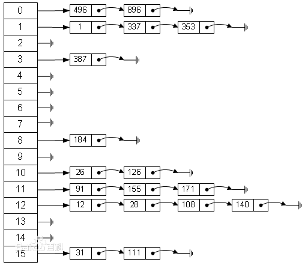
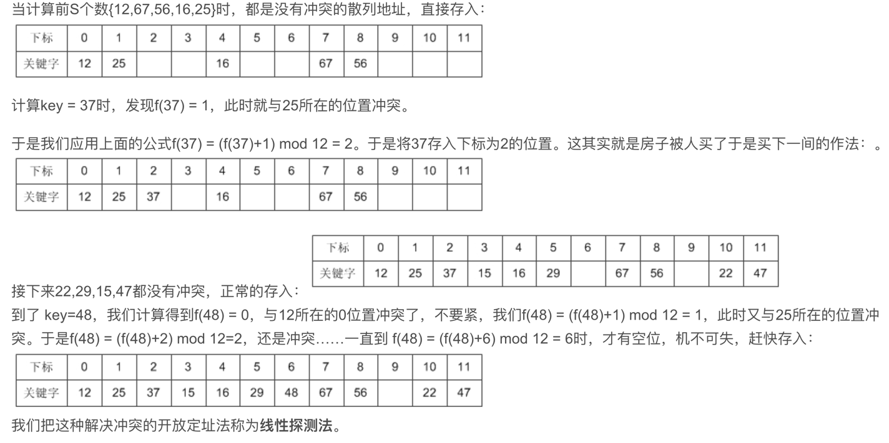

# 哈希表
哈希表(Hash Table，也叫散列表)，可以根据关键码的值直接访问数据的数据结构。

哈希表的常用场景一般用于快速判断一个元素是否出现在集合中。比如检索一个学生是否在这所学校的名单，只需将学生名字放入哈希表里，通过索引就可以快速查询这名学生
是否在名单中。

# 哈希函数
哈希函数的作用是将学生的名字直接映射为哈希表上的索引，通过查询索引就可以查询到这名学生的姓名。哈希表产生的问题：
1. 哈希碰撞又叫哈希冲突；

# 哈希碰撞
哈希碰撞现象是两个不同学生的姓名，经过hashCode计算，对应的索引是相同的位置。解决哈希碰撞有两种方法:
1. 拉链法(链地址法)；
2. 开放地址法：
   1. 线性探测再散列；
   2. 二次探测再散列；
   3. 伪随机探测再散列；
3. 再哈希法；
4. 建立一个公共溢出区；
## 拉链法
数组与链表相结合：创建一个链表数组，数组中的每一格就是一个链表，如果遇到哈希冲突，则将冲突的值加到链表中即可。如图所示:



1. 优点：
   1. 拉链法处理冲突简单，且无堆积现象，即非同义词决不会发生冲突，因此平均查找长度较短；
   2. 由于拉链法中各链表上的结点空间是动态申请的，故它更适合于造表前无法确定表长的情况；
   3. 开放定址法为减少冲突，要求装填因子α较小，故当结点规模较大时会浪费很多空间。而拉链法中可取α≥1，且结点较大时，拉链法中增加的指针域可忽略不计，
   因此节省空间；
   4. 在用拉链法构造的散列表中，删除结点的操作易于实现。只要简单地删去链表上相应的结点即可。而对开放地址法构造的散列表，删除结点不能简单地将被删结
   点的空间置为空，否则将截断在它之后填人散列表的同义词结点的查找路径。这是因为各种开放地址法中，空地址单元(即开放地址)都是查找失败的条件，因此在 
   用开放地址法处理冲突的散列表上执行删除操作，只能在被删结点上做删除标记，而不能真正删除结点。
2. 缺点：指针需要额外的空间；而若将节省的指针空间用来扩大散列表的规模，可使装填因子变小，这又减少了开放定址法中的冲突，从而提高平均查找速度
## 开放地址法
发生冲突进行探查，沿探查序列进行探查。只要散列表足够大，空的散列地址总能找到，并将记录存入。
```text
Hi=(H(key)+di) MOD m i=1,2,…,k(k<=m-1)
其中，m为哈希表的表长。di 是产生冲突的时候的增量序列
```
1. 线性探测再散列:如果di值可能为1,2,3,…m-1，称线性探测再散列;
2. 如果di取1，则每次冲突之后，向后移动1个位置.如果di取值可能为1,-1,2,-2,4,-4,9,-9,16,-16,…kk,-kk(k<=m/2)，称二次探测再散列;
3. 如果di取值可能为伪随机数列。称伪随机探测再散列;

如图所示：
用开放定址法解决冲突的做法是：当冲突发生时，使用某种探测技术在散列表中形成一个探测序列。沿此序列逐个单元地查找，直到找到给定的关键字，或者碰到一
个开放的地址（即该地址单元为空）为止（若要插入，在探查到开放的地址，则可将待插入的新结点存人该地址单元）。查找时探测到开放的地址则表明表中无待查
的关键字，即查找失败。


比如说，我们的关键字集合为{12,67,56,16,25,37,22,29,15,47,48,34},表长为12。 我们用散列函数f(key) = key mod l2。


优缺点：
1. 缺点：
   1. 容易产生堆积问题；不适于大规模的数据存储；
   2. 散列函数的设计对冲突会有很大的影响；插入时可能会出现多次冲突的现象，删除的元素是多个冲突元素中的一个，需要对后面的元素作处理，
   实现较复杂；结点规模很大时会浪费很多空间
2. 优点：结点规模较小时，开放定址法较为节省空间
## 再哈希法
当发生冲突时，使用第二个、第三个、哈希函数计算地址，直到无冲突时。
比如上面第一次按照姓首字母进行哈希，如果产生冲突可以按照姓字母首字母第二位进行哈希，再冲突，第三位，直到不冲突为止
1. 缺点：计算时间增加；
## 建立一个公共溢出区
假设哈希函数的值域为[0,m-1],则设向量HashTable[0..m-1]为基本表，另外设立存储空间向量OverTable[0..v]用以存储发生冲突的记录。
1. 缺点：浪费内存；


