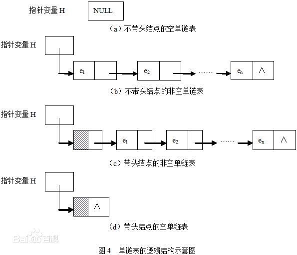
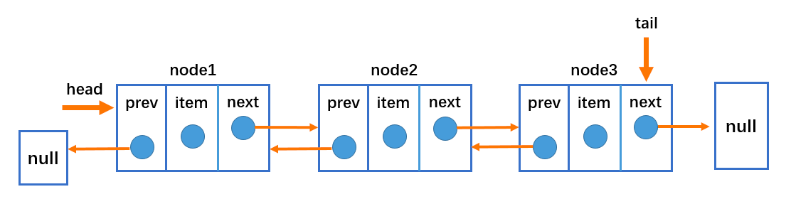
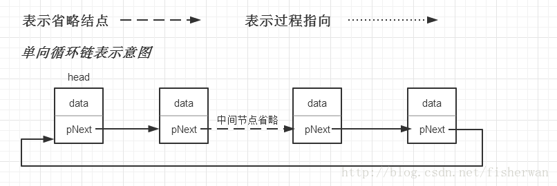
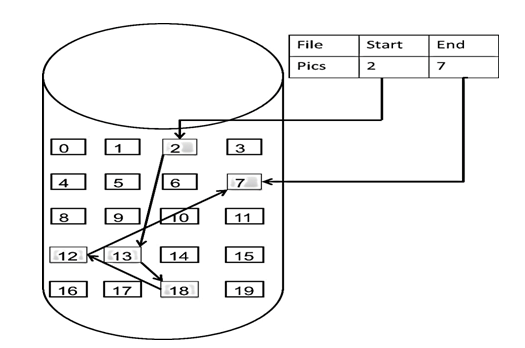

# 链表理论基础

链表是一种通过指针串联在一起的的线性结构。每个节点由两部分组成: 一个是数据域，另一个是指针域(存放指向下一个节点的指针)，最后一个节点的指针域指向 NULL
(空指针)。

链接的入口点称为链表的头节点，也就是 head。

# 链表的类型

## 单链表

如图所示：



## 双链表

单链表中的节点只能指向节点中的下一个节点，而双链表中的每一个节点有两个指针域，一个指向下一个节点，另一个指向上一个节点。双链表既可以向前查询，也可以
向后查询。



## 循环链表

循环链表就是首尾相连的链表。



# 链表的存储方式

数组在内存中是连续分配的，但链表在内存中的存储却不是连续分布的。链表是通过指针域的指针来链接内存中各个节点。所以链表中的节点在内存中是不连续的，而是
散乱分布在内存的地址上，分配机制取决于操作系统的内存管理。如所示:



# 链表的代码定义

```java
public class ListNode {
    public int val;
    public ListNode next;

    public ListNode(int val) {
        this.val = val;
    }

    ListNode(int val, ListNode next) {
        this.val = val;
        this.next = next;
    }
}
```

# 移除链表元素

1. 题目链接: [203-移除链表元素](https://leetcode.cn/problems/remove-linked-list-elements/)
2. 考察点: 链表的操作

代码实现:

```java
public class Solution {
    public ListNode removeElements(ListNode head, int val) {
        // 建立一个虚拟节点指向给出的头节点
        ListNode virtualNode = new ListNode(0);
        virtualNode.next = head;
        ListNode currNode = virtualNode;
        while(currNode.next != null){
            if(currNode.next.val == val){
                virtualNode.next = currNode.next.next;

            }else {
                currNode = currNode.next;
            }
        }
        return head;
    }
}
```

# 链表常见的六个操作

1. 题目链接: [707-设计链表](https://leetcode.cn/problems/design-linked-list/)
2. 考察点: 链表的基本操作

代码实现:

```java
public class LinkedNode {
    public int val = 0;
    public LinkedNode next;

    public LinkedNode(int val) {
        this.val = val;
    }
}

public class MyLinkedListNode {

    public LinkedNode virtualNode;

    public MyLinkedListNode() {
        virtualNode = new LinkedNode(0);
    }

    /**
     * 插入链表节点-头插法
     *
     * @param val
     */
    public void addAtHead(int val) {
        // 创建一个插入的节点
        LinkedNode insertNode = new LinkedNode(val);
        // 插入节点的下一个指针域指向虚拟节点的下一个指针域
        insertNode.next = virtualNode.next;
        virtualNode.next = insertNode;
    }


    /**
     * 插入链表节点-尾插法
     *
     * @param val
     */
    public void addAtTail(int val){
        // 创建一个插入的节点
        LinkedNode insertNode = new LinkedNode(val);
        LinkedNode currNode = virtualNode;
        while (currNode.next != null){
            currNode = currNode.next;
        }
        currNode.next = insertNode;
    }

    /**
     * 插入指定位置节点
     *
     * @param index
     * @param val
     */
    public void addAtIndex(int index, int val) {
        //如果 index 等于链表的长度，则该节点将附加到链表的末尾。如果 index 大于链表长度，则不会插入节点。如果index小于0，则在头部插入节点。
        if(index > getNodeLength() || index < 0){
            return;
        }
        // 创建新的节点
        LinkedNode insertNode = new LinkedNode(val);
        LinkedNode currNode = virtualNode;
        for(int i=0; i<index; i++){
            currNode = currNode.next;
        }
        insertNode.next = currNode.next;
        currNode.next = insertNode;
    }

    /**
     * 删除第 index 个节点
     *
     * @param index
     */
    public void deleteAtIndex(int index) {
        // 当 index = 实际长度, 表明删除节点不存在
        if(index >= getNodeLength() || index < 0){
            return;
        }

        LinkedNode currNode = virtualNode;
        for(int i=0; i<index; i++){
            currNode = currNode.next;
        }
        // 记录删除节点的下一个节点
        currNode.next = currNode.next.next;
    }

    /**
     * 获取某个节点
     *
     * @param index
     * @return
     */
    public int get(int index) {
        // 当 index = 实际长度, 表明获取节点不存在
        if(index >= getNodeLength() || index < 0){
            return -1;
        }
        LinkedNode currNode = virtualNode;
        for(int i=0; i<index; i++){
            currNode = currNode.next;
        }
        return currNode.next.val;
    }

    public void printMyLinkedListNode(){
        LinkedNode currNode = virtualNode;
        while(currNode.next != null){
            System.out.println("MyLinkedListNode current value= " + currNode.next.val);
            currNode = currNode.next;
        }
    }

    public int getNodeLength(){
        int length = 0;
        LinkedNode currNode = virtualNode;
        while(currNode.next != null){
            length++;
            currNode = currNode.next;
        }
        return length;
    }
}
```

# 反转链表
1. 题目链接: [206-反转链表](https://leetcode.cn/problems/reverse-linked-list/submissions/)
2. 考察点: 双指针用法

代码实现:
```java
class Solution {
    public ListNode reverseList(ListNode head) {
        // 创建虚拟头节点方便操作
        ListNode virtualNode = new ListNode(0);
        virtualNode.next = head;
        // 创建临时节点保存断链后的节点数据
        ListNode tmp;
        // 前置指针
        ListNode pre = null;
        // 当前节点 等于 虚拟头节点
        ListNode currNode = virtualNode;
        while(currNode.next != null){
            tmp = currNode.next.next; // 2->3->4->5

            // 断链
            currNode.next.next = pre; // 1的下一个指针域指向 null;
            pre = currNode.next; // 1->null  
            // 头节点指针域指向下保存的临时链表, 此时有两个链表，一个 pre：1->null 另一个 tmp
            currNode.next = tmp;
        }
        virtualNode.next = pre;
        return virtualNode.next;
    }
}
```

# 两两交换链表中的节点
1. 题目链接：[24. 两两交换链表中的节点](https://leetcode.cn/problems/swap-nodes-in-pairs/)
2. 考察点：模拟操作

没有啥技巧，利用虚拟头节点正常模拟即可。代码实现如下：
```java
class Solution {
    public ListNode swapPairs(ListNode head) {
        // 创建虚拟头节点方便操作 
        ListNode virtualNode = new ListNode(0);
        virtualNode.next = head;
        // 当前节点赋值 = 虚拟头节点
        ListNode currNode = virtualNode;

        // 循环条件 例子以 1-》2 -〉 3 ——》 4
        while(currNode.next != null && currNode.next.next != null){
            // 保存相邻接节点的第一个
            ListNode tmp = currNode.next; // 1 2 3 4
            // 保存与 tmp 不相邻的第一个节点
            ListNode tmp2 = currNode.next.next.next; // 3 4

            currNode.next = currNode.next.next; // 相邻的第二个节点开始移动，2 -》
            currNode.next.next = tmp; // 2 -> 1
            currNode.next.next.next = tmp2; // 2 -> 1 -> 3 -> 4

            currNode = currNode.next.next; // 移动两位
        }
    
        return virtualNode.next;
    }
}
```
# 删除链表的倒数第N个节点
1. 题目链接：[19. 删除链表的倒数第 N 个结点](https://leetcode.cn/problems/remove-nth-node-from-end-of-list/)
2. 考察点：快慢指针
````java
class Solution {
    public ListNode removeNthFromEnd(ListNode head, int n) {
        // 核心思想快慢指针
        // 创建虚拟头节点
        ListNode virtualNode = new ListNode(0);
        virtualNode.next = head;
        ListNode fast = virtualNode;
        ListNode slow = virtualNode;
        // 移动快指针到指定位置
        while (n-- >= 0 && fast != null) {
            fast = fast.next;
        }
        // 快指针再前向移动一步，这样 slow 和 fast 同时移动地时候 slow 才能指向前一个节点
        while (fast != null) {
            slow = slow.next;
            fast = fast.next;
        }
        // 删除节点
        slow.next = slow.next.next;
        return virtualNode.next;
    }
}
````

# 环形链表 II
1. 题目链接：[142. 环形链表 II(https://leetcode.cn/problems/linked-list-cycle-ii/)
2. 考察点：快慢指针
```java

```


