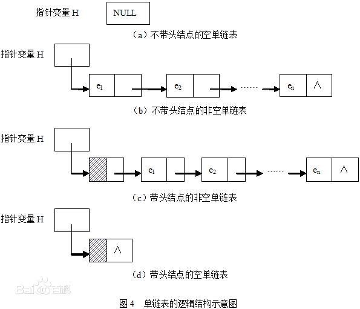
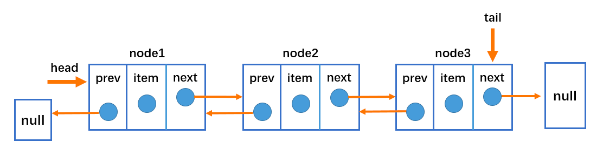
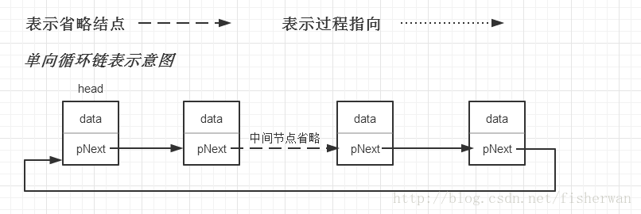
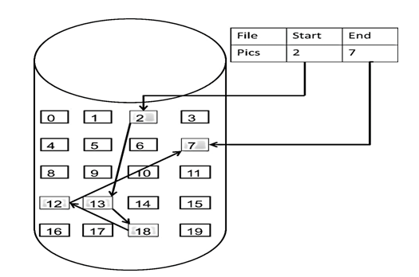

# 链表理论基础

链表是一种通过指针串联在一起的的线性结构。每个节点由两部分组成: 一个是数据域，另一个是指针域(存放指向下一个节点的指针)，最后一个节点的指针域指向 NULL
(空指针)。

链接的入口点称为链表的头节点，也就是 head。

# 链表的类型

## 单链表

如图所示：



## 双链表

单链表中的节点只能指向节点中的下一个节点，而双链表中的每一个节点有两个指针域，一个指向下一个节点，另一个指向上一个节点。双链表既可以向前查询，也可以
向后查询。



## 循环链表

循环链表就是首尾相连的链表。



# 链表的存储方式

数组在内存中是连续分配的，但链表在内存中的存储却不是连续分布的。链表是通过指针域的指针来链接内存中各个节点。所以链表中的节点在内存中是不连续的，而是
散乱分布在内存的地址上，分配机制取决于操作系统的内存管理。如所示:



# 链表的代码定义

```java
public class ListNode {
    public int val;
    public ListNode next;

    public ListNode(int val) {
        this.val = val;
    }

    ListNode(int val, ListNode next) {
        this.val = val;
        this.next = next;
    }
}
```

# 移除链表元素

1. 题目链接: [203-移除链表元素](https://leetcode.cn/problems/remove-linked-list-elements/)
2. 考察点: 链表的操作

代码实现:

```java
public class Solution {
    public ListNode removeElements(ListNode head, int val) {
        // 建立一个虚拟节点指向给出的头节点
        ListNode virtualNode = new ListNode(0);
        virtualNode.next = head;
        ListNode currNode = virtualNode;
        while(currNode.next != null){
            if(currNode.next.val == val){
                virtualNode.next = currNode.next.next;

            }else {
                currNode = currNode.next;
            }
        }
        return head;
    }
}
```

# 链表常见的六个操作

1. 题目链接: [707-设计链表](https://leetcode.cn/problems/design-linked-list/)
2. 考察点: 链表的基本操作

代码实现:

```java

```


